# Semantic Segmentation for Laser Line Detection in Autonomous Welding

Girish Krishnan | [LinkedIn](https://www.linkedin.com/in/girk/) | [GitHub](https://github.com/Girish-Krishnan)
___

This project implements a semantic segmentation model to detect laser lines for autonomous robot welding. The model uses a U-Net architecture to predict binary masks indicating laser lines in input images. The application is tailored for the detection of precise welding paths in automated systems, improving welding accuracy and efficiency.

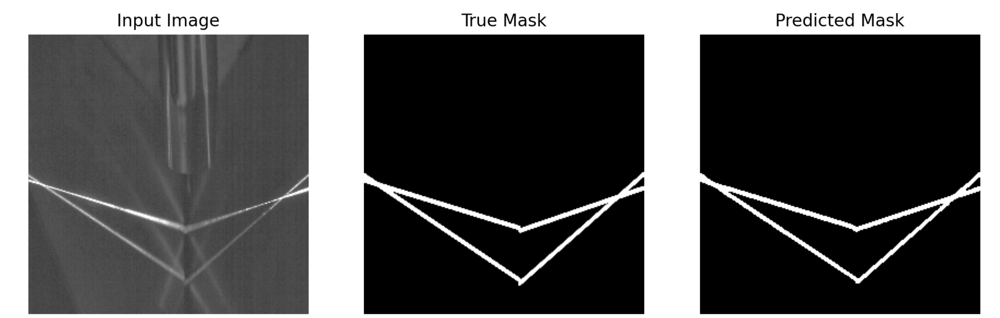

|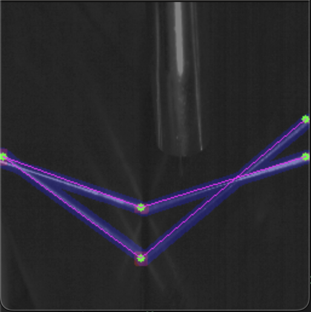|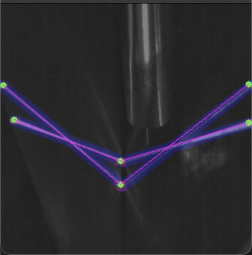|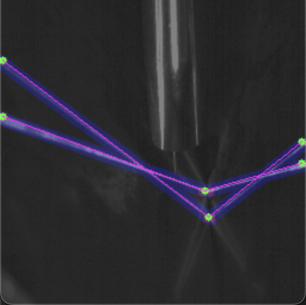|
|---|---|---|
|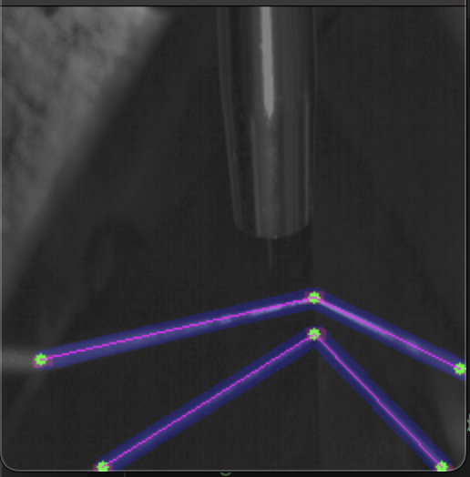|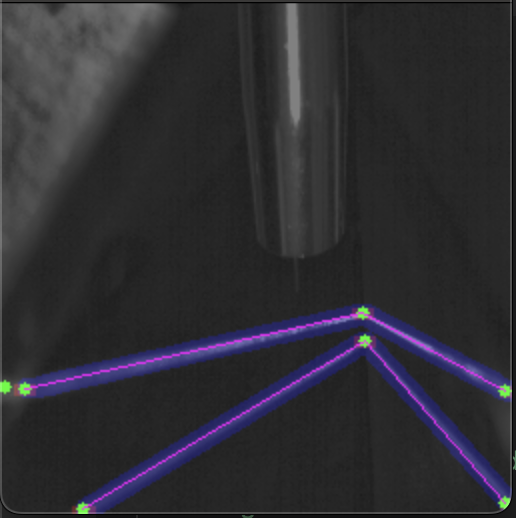|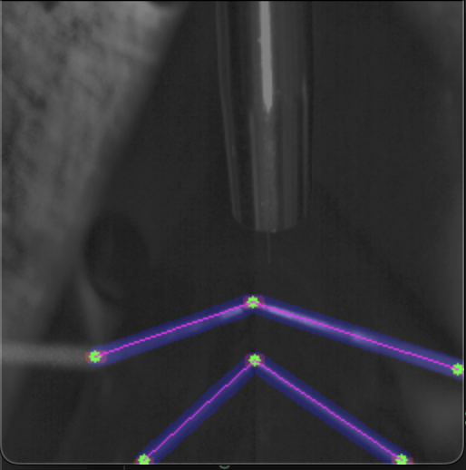|

---

## Table of Contents

- [Semantic Segmentation for Laser Line Detection in Autonomous Welding](#semantic-segmentation-for-laser-line-detection-in-autonomous-welding)
  - [Table of Contents](#table-of-contents)
  - [Overview](#overview)
  - [Setup](#setup)
  - [Usage](#usage)
    - [Arguments](#arguments)
    - [Training](#training)
    - [Inference and Visualization](#inference-and-visualization)
  - [Modifying Hyperparameters](#modifying-hyperparameters)
  - [Results](#results)
    - [Example Visualizations](#example-visualizations)
  - [Contributing](#contributing)
  - [License](#license)

---

## Overview

The project focuses on semantic segmentation for precise laser line detection in welding images. The model predicts binary masks where white pixels represent the laser line regions. The dataset includes input images and corresponding binary masks, which are resized and normalized for training.

Here is the architecture of the U-Net model used for semantic segmentation, assuming an input image size of 256x256 pixels:

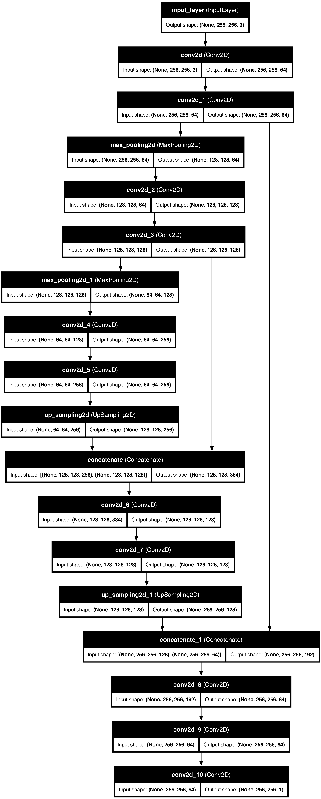

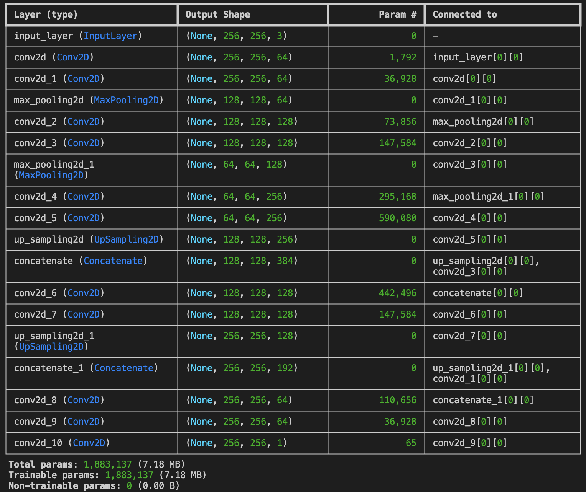

---

## Setup

1. **Clone the Repository:**

   ```bash
   git clone https://github.com/Girish-Krishnan/Semantic-Segmentation-Laser-Line-Detection.git
   cd Semantic-Segmentation-Laser-Line-Detection
   ```

2. **Install Dependencies:**

   Use the `requirements.txt` file to install dependencies:

   ```bash
   pip install -r requirements.txt
   ```

3. **Download the Dataset:**

   The dataset is available on Google Drive. Download and extract it:

   - Link: [Google Drive Dataset](https://drive.google.com/drive/folders/1bpMcHkrK8EBCmLSrUpW1UMKHBbQAZlg9?usp=sharing)
   - Extract the data into the `data/` folder so it looks like this:

     ```
     data/
     ├── images/  # Input images
     └── masks/   # Corresponding binary masks
     ```

---

## Usage

### Arguments

| Argument        | Type     | Description                                         |
|------------------|----------|-----------------------------------------------------|
| `--image_dir`   | `str`    | Path to the directory containing input images (Example: `./data/images`).     |
| `--mask_dir`    | `str`    | Path to the directory containing mask images (Example: `./data/masks`).      |
| `--config`      | `str`    | Path to the YAML configuration file (Example: `./config/hyperparameters.yaml`).               |
| `--train`       | `flag`   | Flag to train a new model. If set, then a new model is trained. Otherwise, the model from the `--model_path` argument is loaded and inference is run.                        |
| `--model_path`  | `str`    | Path to save or load the model.                    |
| `--num_samples` | `int`    | Number of test samples to visualize when running inference. Default is 5.      |

### Training

To train a new model:

```bash
python main.py \
    --image_dir data/images \
    --mask_dir data/masks \
    --config config/hyperparameters.yaml \
    --train \
    --model_path models/unet_model.keras
```

### Inference and Visualization

To load a pre-trained model and visualize predictions:

```bash
python main.py \
    --image_dir data/images \
    --mask_dir data/masks \
    --config config/hyperparameters.yaml \
    --model_path models/unet_model.keras \
    --num_samples 5
```

---

## Modifying Hyperparameters

Hyperparameters are defined in the `config/hyperparameters.yaml` file. Modify this file to adjust training parameters such as:

- `img_height`: Height of the resized images.
- `img_width`: Width of the resized images.
- `batch_size`: Number of samples per training batch.
- `epochs`: Number of training epochs.
- `test_size`: Proportion of data used for testing.

Example:

```yaml
img_height: 512
img_width: 512
batch_size: 16
epochs: 100
test_size: 0.3
```

---

## Results

### Example Visualizations

Here are sample predictions on the testing set showing input images, ground truth masks, and predicted masks:

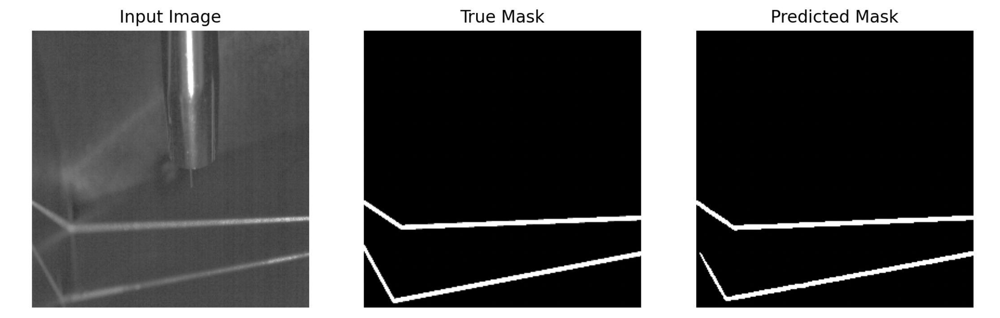
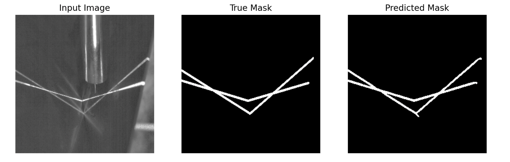

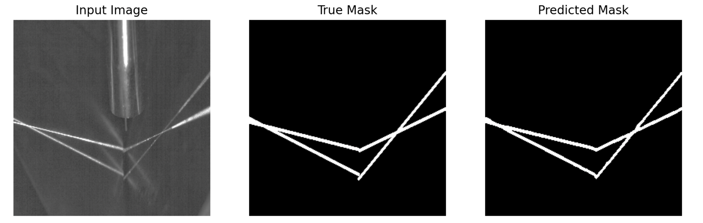
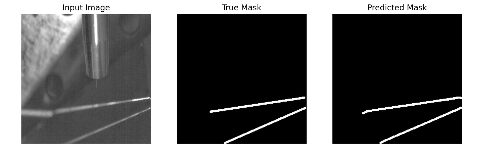
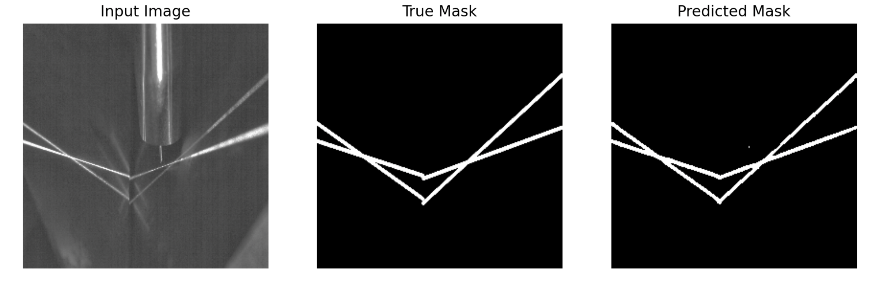
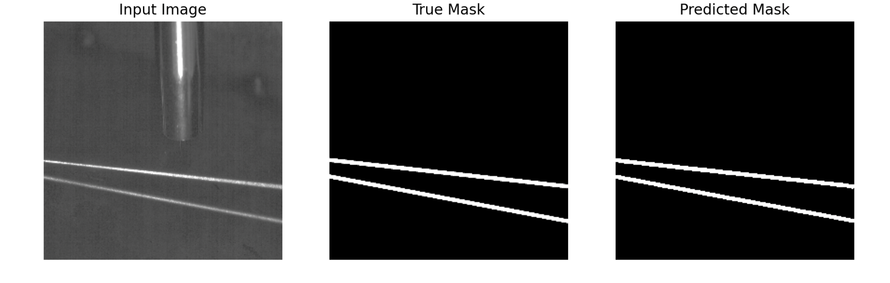
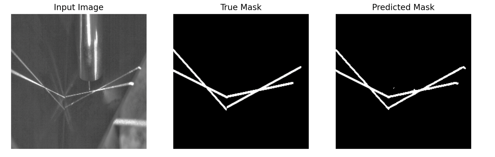
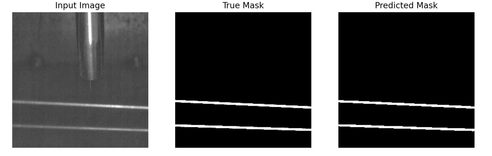
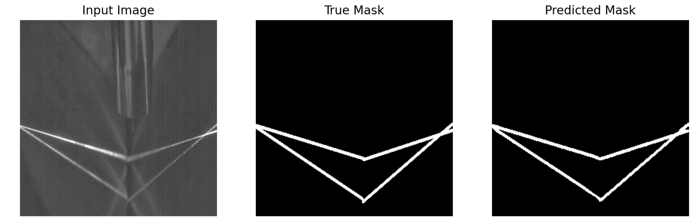

If you combine this UNet model with other computer vision techniques such as line detection, you can get the exact coordinates of the start and end points of the laser line, as shown below:

||||
|---|---|---|
||||

---

## Contributing

Contributions are welcome! To contribute, feel free to open a pull request or issue. For major changes, please open an issue first to discuss the changes.

---

## License

This project is licensed under the MIT License. See the `LICENSE` file for details.

